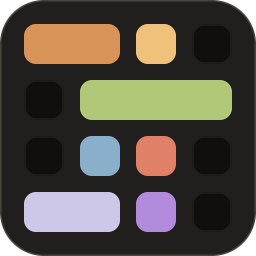

# Brand icon and Marketplace presentation

The package icon is **C2 "Line Break"**: a code block reduced to seven token bars
and five recessed wells on a warm slate plate. It is the extension's only shipped
image, and it is generated, not hand-edited.



## Authorship, rights and what it replaced

The mark was **originally drawn for this repository** as deterministic vector code in
[`scripts/icon.mjs`](../scripts/icon.mjs). It contains no third-party artwork, font
glyph, photograph, trace, clip art or generated image, and no gradient, filter or
external reference of any kind. Every colour is resolved from
[`tokens/palette.json`](../tokens/palette.json); the geometry is plain rounded
rectangles.

It replaces the inherited 640 kB photographic `icon.png` that shipped through 3.4.0.
That asset's origin, author and licence were never recorded, so it could not be
re-cropped, re-encoded or re-published with confidence. It was **removed rather than
retained**: it is not in `assets/`, not in the VSIX and not in the release archives.
Only its absence is documented here.

Recorded in [`tokens/provenance.json`](../tokens/provenance.json) as `brand-icon`.
As everywhere else in this project, provenance is not permission — the repository
licence remains unresolved, and nothing here assigns or infers one.

## Geometry

Canvas **256 × 256**, `viewBox="0 0 256 256"`, content bounding box `24,24 → 232,232`,
so the **safe margin is 24 px on all four sides**. Every module value — origin, cell,
gap, pitch and every span — is a multiple of 8.

| Constant | Value |
|---|---|
| Module origin | `24` |
| Cell | `40` |
| Gap | `16` |
| Pitch | `56`, so tracks land on `24, 80, 136, 192` |
| Span of *n* columns | `56n − 16`, so `40, 96, 152, 208` |
| Bar and well corner radius | `12` |
| Plate corner radius | `44` |

Pitch 56 and origin 24 are exact pixel multiples at 256, 128, 64 and **32 px**. They
are not at 16 px, which is why the favicon sibling below uses its own 16 px module
instead of pretending the master downsamples that far.

## Palette tokens

The artwork resolves ten palette tokens and invents no colour of its own.

| Element | Token | Value |
|---|---|---|
| Plate | `palette.phase3.ambient` | `#211f1e` |
| Recessed wells | `palette.phase4.ambient` | `#100f0e` |
| Plate keyline and well hairlines | `palette.phase3.border` | `#655d53` |
| Declarations bar | `palette.phase2.copper` | `#d99559` |
| Tags and types bar | `palette.phase2.honey` | `#efc17b` |
| Strings span | `palette.phase2.olive` | `#b2c879` |
| Literals bar | `palette.phase2.blue` | `#8aafcb` |
| Calls bar | `palette.phase2.terracotta` | `#e08066` |
| Variables bar | `palette.phase2.lavender` | `#cec8e8` |
| Regex bar | `palette.phase2.purple` | `#b18adb` |

A palette edit therefore changes the icon, and the generated icon is checked in CI,
so palette drift cannot silently desynchronise the branding.

## Gallery banner

`galleryBanner.color` is `#302e2c` — `palette.phase2.charcoal`, the flagship
`editor.background`. Through 3.4.0 the banner used the plate colour `#211f1e`, so the
tile met its own background at 1.00:1 and dissolved into it. Moving the **banner**
rather than the plate keeps the strongest bar contrast on the icon (copper 6.56:1,
terracotta 5.82:1 against the plate) and makes the Marketplace header match what
users actually see in the editor. A test asserts the two values stay different.

The plate is also 1.00:1 against a `#1F1F1F` VS Code or Marketplace dark surface, so
the tile boundary is carried entirely by the 60 % keyline: 1.72:1 there and 1.97:1 on
GitHub's `#0D1117`. These are icon-artwork measurements, not a WCAG conformance claim;
the [accessibility contract](accessibility.md) is unchanged by this release.

## Generating and exporting

```sh
npm run icon        # rewrite icon.png and the assets/ vector sources
npm run check       # theme, portable and icon drift gates
```

`scripts/icon.mjs` renders the vector master and rasterizes it with a deterministic
software rasterizer: uniform 8 × 8 supersampling of exact rounded-rectangle coverage,
composited source-over in encoded sRGB per sample, then box-filtered to the output
pixel — the "render large, downsample" path, without a browser, headless host,
image library or network access. The same command on any platform produces the same
pixels.

The export is **8-bit RGBA, non-interlaced, filter 0**, and carries **only `IHDR`,
`IDAT` and `IEND`**: no `tEXt`, `tIME`, `pHYs`, XMP packet or other ancillary chunk,
so the file has no embedded history to leak or misstate. Measured size is about
5.1 kB against the replaced asset's 639 828 B, a 99.2 % reduction.

`npm run check` compares decoded pixels and chunk structure rather than compressed
bytes, so the gate survives zlib implementation differences while still failing on
replaced artwork, wrong dimensions, reintroduced metadata or palette drift.

## Shipped and source assets

| File | Ships in the VSIX | Purpose |
|---|---|---|
| `icon.png` | **Yes** | The only image in the package. Marketplace tile, Extensions sidebar and search list. |
| [`assets/icon.svg`](../assets/icon.svg) | No | The editable 1 740-byte vector master. Use this, never a re-traced PNG, for any new size or surface. |
| [`assets/icon-favicon.svg`](../assets/icon-favicon.svg) | No | 16 / 32 px sibling on a 16 px grid, opaque plate, wells dropped. Held as source for documentation-site favicons; not used by the extension today. |
| [`assets/icon-avatar.svg`](../assets/icon-avatar.svg) | No | Artwork at 80 % about the centre on an opaque square plate, so a circular crop keeps the whole composition. Held as source for GitHub organisation or social avatars; not used by the extension today. |

`assets/**` is in `.vscodeignore`. Packaging stays lean and deliberate: the VSIX
carries the one 256 × 256 PNG that VS Code and the Marketplace actually read, while
the editable vector sources stay in the repository and the GitHub release, where they
can be revised. `vsce` requires a square icon of at least 128 × 128; 256 gives
Marketplace retina headroom.

## Screenshots

Marketplace screenshots are a separate, unchanged pipeline: see
[the gallery](gallery.md) and [capture instructions](capturing.md). They stay outside
the VSIX.
