# Specials Board visual gallery

Thirteen real VS Code workbench captures, not hand-painted editor mockups.
The nine original dark images and four dark palettes are unchanged from the
3.3.0 gallery and 3.2.0 theme baseline respectively. Four Light images were
captured on 2026-09-09 from the revised 3.5.0 whiteboard/marker candidate,
replacing the earlier warm-paper previews, using the same pinned VS Code
1.136.2 Windows `serve-web` host. Open an image for full-size text;
the [source fixtures](../test%20files/presentation/) are also available as text.
The [capture guide](capturing.md) records the host, settings, automation and
provider boundaries. These static examples do not substitute for the
[accessibility measurements and limitations](accessibility.md).

## Dark and Light: the same workbench fixture

| Specials Board (original dark capture) | Specials Board Light (2026-09-09) |
|---|---|
| 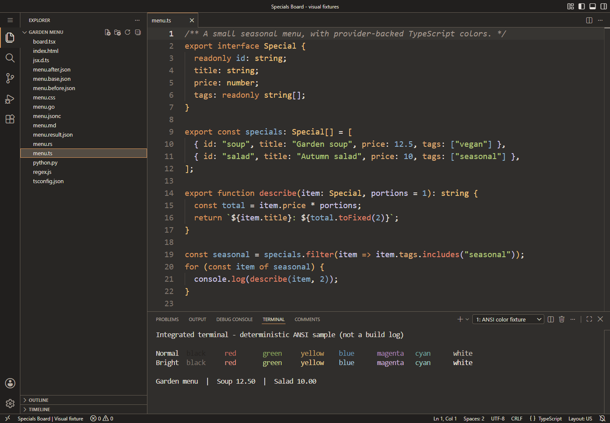 | 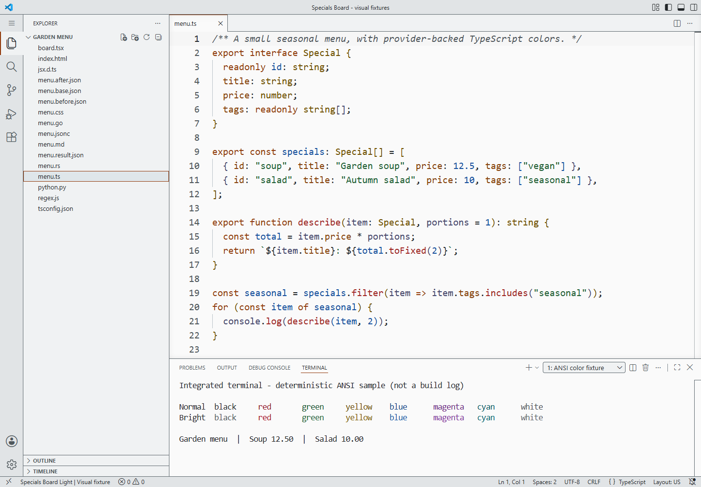 |

The same `menu.ts` and deterministic terminal fixture show the shift from
charcoal chalkboard to neutral whiteboard (`#fafafa`) with saturated marker
colors, without recoloring either image. Neutral-gray ambient (`#e1e4e6`) and
navigation (`#f0f2f3`) surfaces frame the editor; raised surfaces use white
(`#ffffff`). Open each
image for readable 1440 × 1000 text. The Light status label, editor, sidebar,
tabs and terminal are actual host surfaces. ANSI black and white are shown as
authored with terminal minimum-contrast adjustment disabled; the terminal is
not a shell command or test transcript.

## Light: HTML and CSS

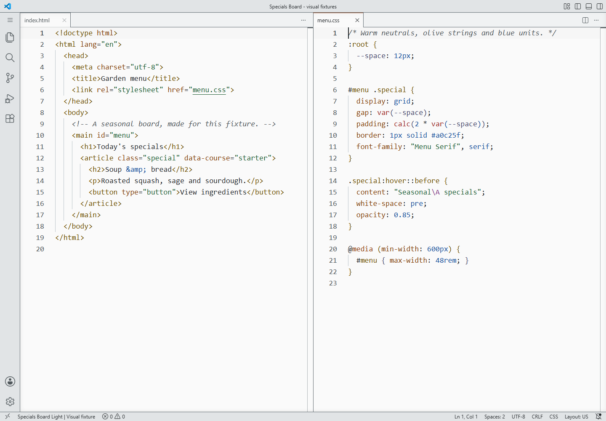

Bundled HTML/CSS support renders the same web fixtures as the dark example.
No color-decorator swatches obscure the authored syntax colors.

## Light: Python, JavaScript and regular expressions

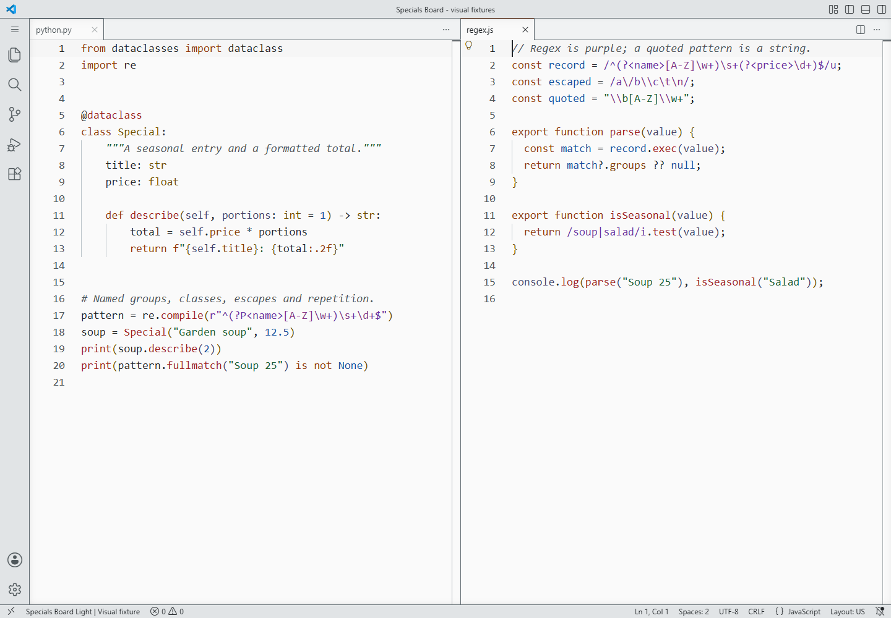

Python uses bundled TextMate support without a Python language server.
JavaScript uses the bundled language service. Regex bodies, escapes and
ordinary strings rely on grammar classification, not guessed source content.

## Light: Markdown, YAML frontmatter and JSONC

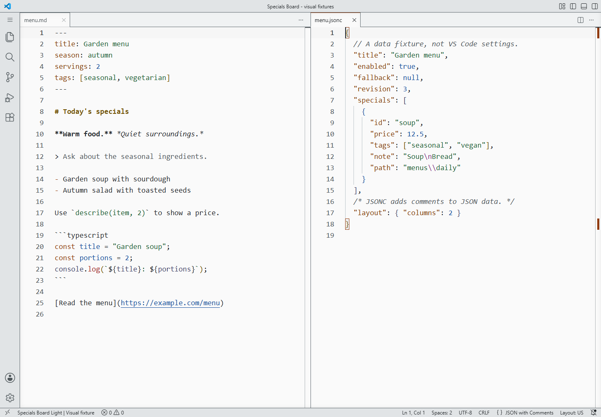

This reuses the dark content fixture: embedded YAML and TypeScript grammars
within Markdown, alongside JSON data syntax with comments. It is not a claim
of a separate YAML language server or rendered Markdown preview.

## Flagship: TypeScript and the workbench

The built-in TypeScript provider refines symbol classification. For example,
readonly constants can be blue rather than the ordinary variable family's
lavender. The coordinated Explorer, active tab, current line, panel and terminal
show the ambient/navigation/content hierarchy. Terminal output is a labeled
local pseudoterminal fixture, not a shell prompt, command execution or test result.
Its black slots are deliberately shown as authored, without VS Code's optional
minimum-contrast adjustment; they are dim in flagship. Contrast's readable
ANSI black is documented separately in the color contract.

## Flagship: TSX

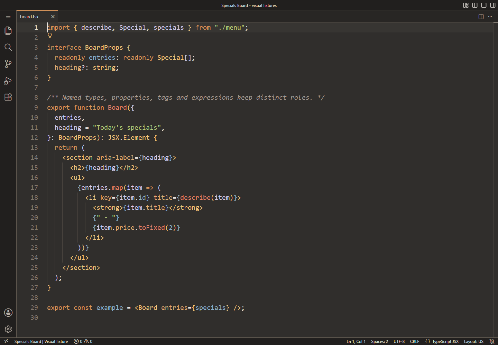

This dependency-free JSX fixture declares its local JSX types. It demonstrates
TypeScript/TSX classification, not a running React application or a claim that
the theme installs React tooling. The companion `menu.ts` supplies its real types.

## Flagship: HTML and CSS

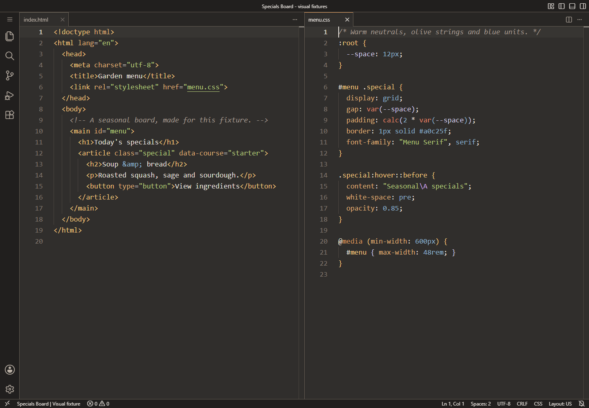

Bundled grammars and language support render HTML and CSS with the restored
role families. Color swatch decorations are disabled in the capture profile
so the literal's theme color stays visible; the theme does not disable them.

## Classic: Python and regular expressions

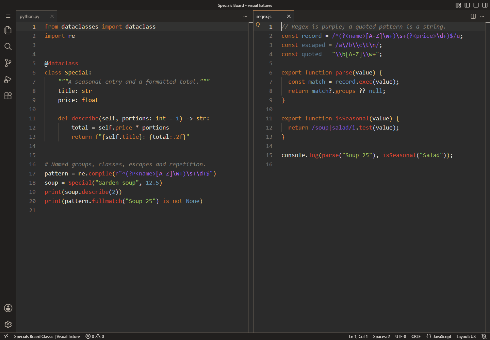

Python uses bundled TextMate support without a Python language server. JavaScript
has the bundled language service, so constants may be refined to blue. Quotes
and delimiters still matter: a string containing regex-like text is not
automatically classified as a regex. Classic's quieter comments are a documented
readability departure; some historical syntax colors remain low-contrast.

## Contrast: Rust and Go

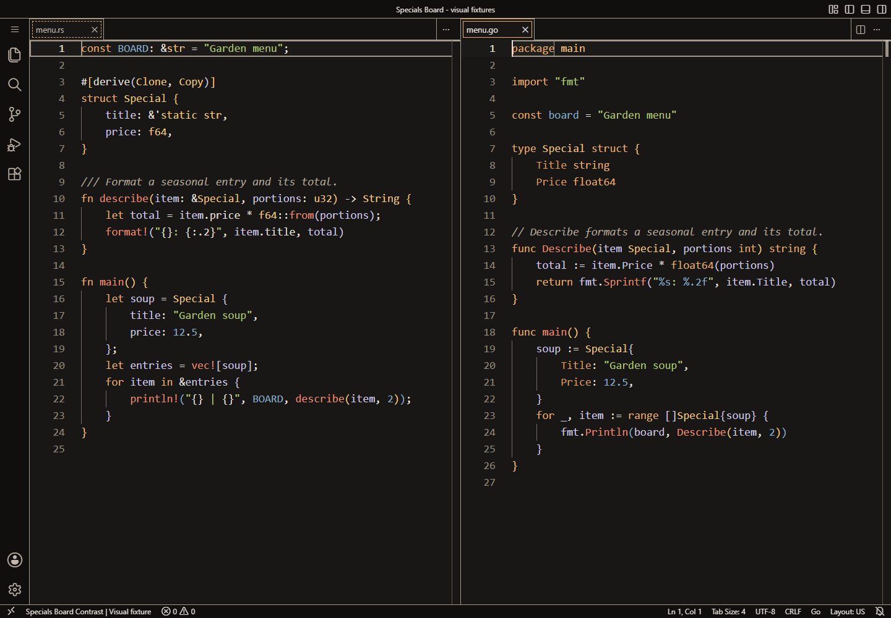

Both use bundled TextMate grammars, **without rust-analyzer or a Go extension**.
The image demonstrates fallback syntax, not semantic-token, hover or language-server
coverage for those languages. The focus and current-line boundaries are
intentional Contrast additions.

## Flagship: Markdown, YAML frontmatter and JSONC

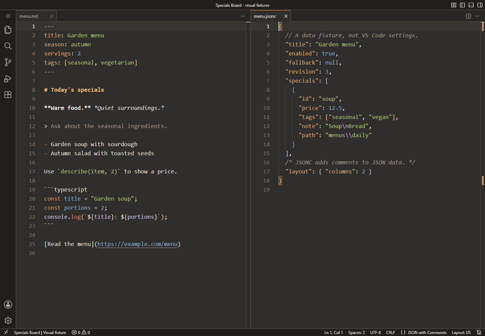

The frontmatter and typed code fence use the bundled embedded grammars.
JSONC adds comments to the ordinary JSON data syntax. Quoted YAML keys can
remain string-colored when a grammar does not distinguish them from values;
the theme cannot manufacture missing scopes.

## Contrast: JSON diff and local review

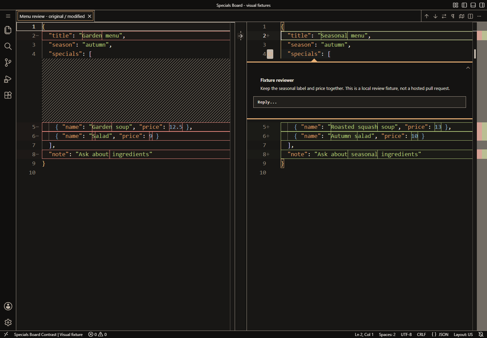

The diff is VS Code's actual original/modified editor. A development-only
fixture registers the native comment thread; this is **not a hosted pull
request**, an account, or a review extension screenshot. Signs, labels and
separate panes accompany color. The data is valid JSON.

## Contrast: three-way merge

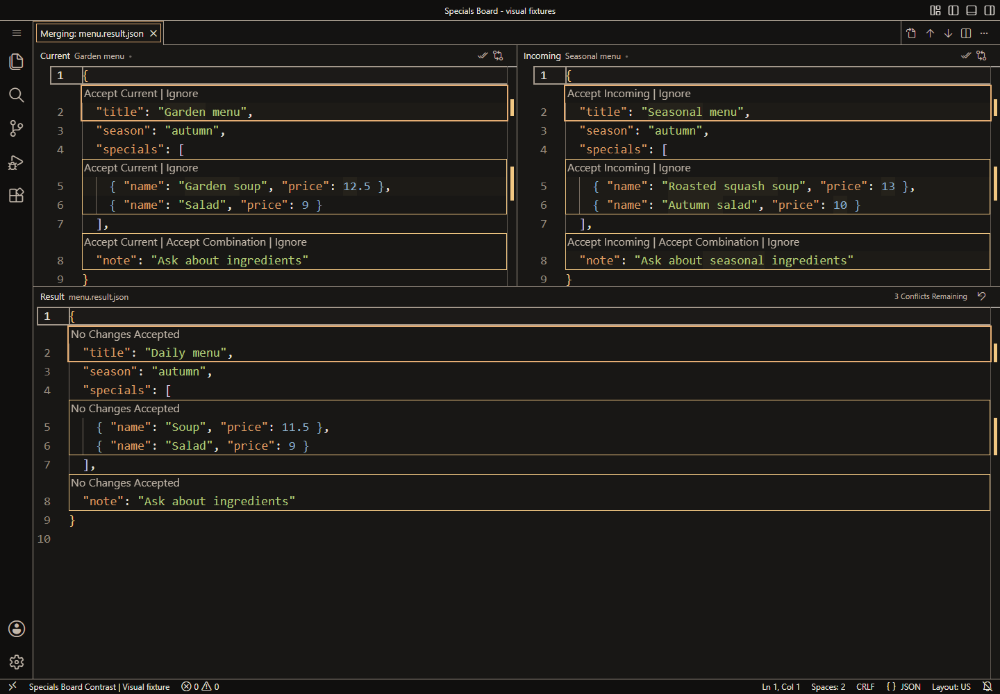

The native merge editor is open on three purpose-written JSON revisions.
Nothing has been accepted: the conflict count and result are real host state.
An internal version-pinned command is used only by the development fixture.
It is not shipped as extension runtime code.

## Deprecated Legacy: the old VS Code port

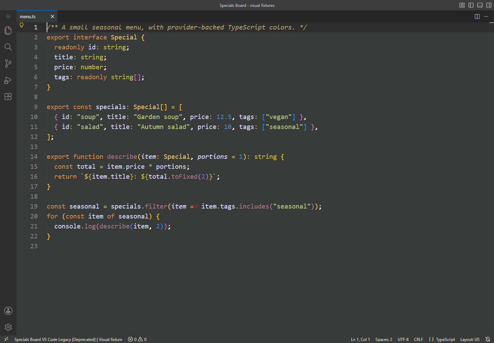

Legacy uses its frozen ordered TextMate rules; the profile's
`configuredByTheme` semantic setting does not enable semantics for Legacy.
It retains compatibility limitations and is not Classic. Use the
[migration guide](migration.md) to select its normalized ID.
